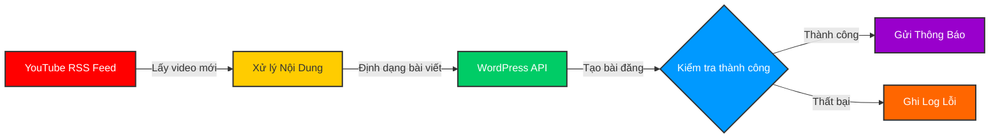
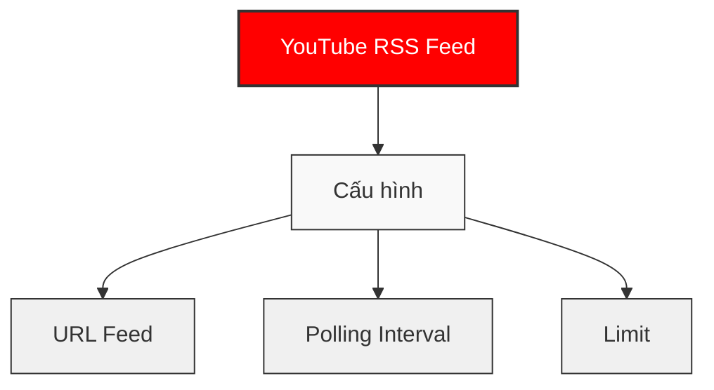
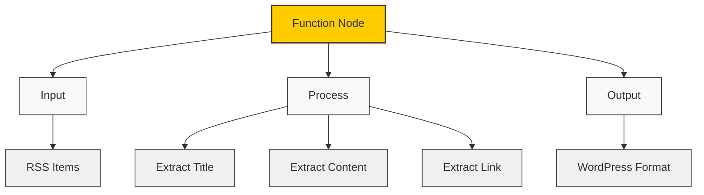
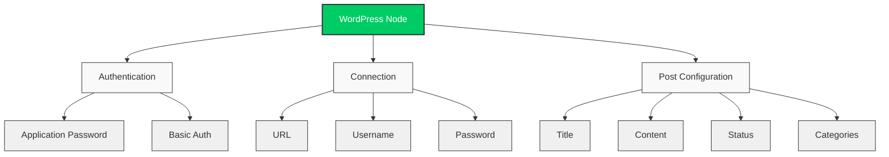
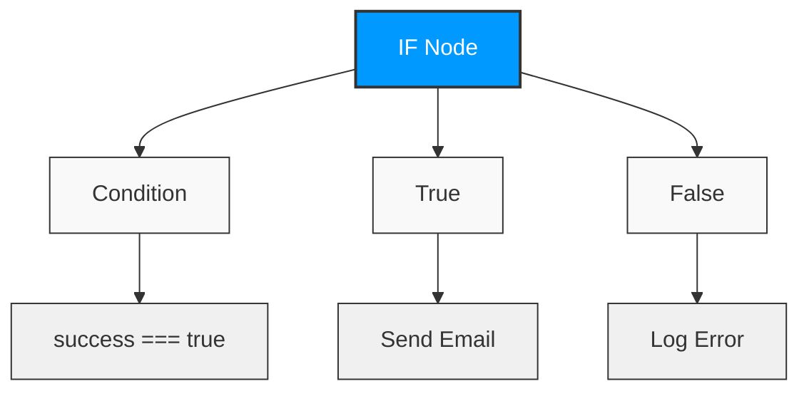
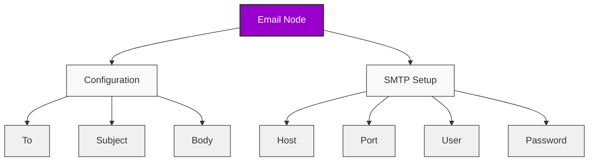
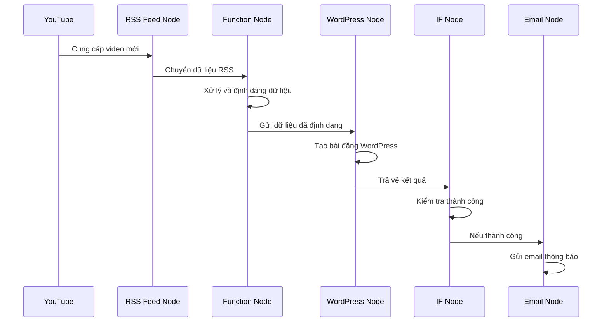
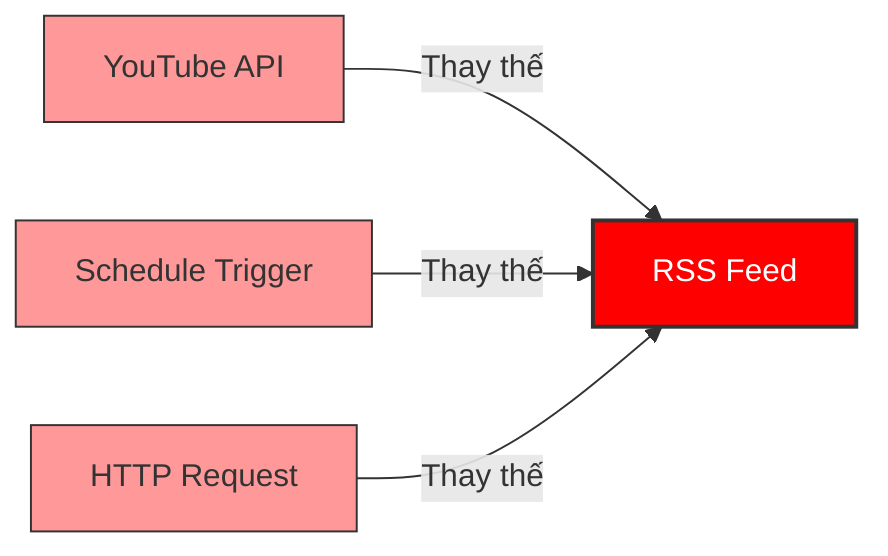
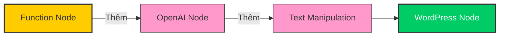
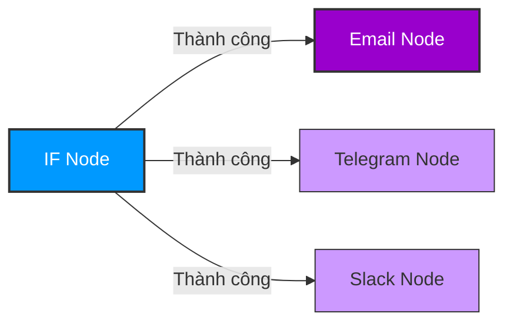

# Sơ Đồ Workflow n8n Cải Tiến

## Tổng Quan Workflow



## Chi Tiết Các Node

### 1. YouTube RSS Feed Node



**Cấu hình chi tiết:**
- **URL Feed**: `https://www.youtube.com/feeds/videos.xml?channel_id=YOUR_CHANNEL_ID`
- **Polling Interval**: Tần suất kiểm tra feed (mặc định: 5 phút)
- **Limit**: Số lượng video mới nhất muốn lấy (ví dụ: 5)

### 2. Xử Lý Nội Dung Node



**Code xử lý:**
```javascript
// Xử lý dữ liệu từ RSS Feed
for (const item of items) {
  // Lấy tiêu đề và nội dung từ item
  const title = item.title;
  const content = item.content || item.summary || item.description;
  const link = item.link;
  
  // Tạo nội dung WordPress
  item.wordpress = {
    title,
    content: `${content}<p>Nguồn: <a href="${link}">${link}</a></p>`,
    status: "draft",
    categories: [1],
    featured_media: 0,
    excerpt: item.summary || ""
  };
}

return items;
```

### 3. WordPress API Node



**Cấu hình chi tiết:**
- **Authentication**: Application Password (khuyến nghị)
- **URL**: URL của website WordPress (ví dụ: https://example.com)
- **Username**: Tên người dùng WordPress
- **Password**: Mật khẩu ứng dụng hoặc mật khẩu thông thường
- **Resource**: Post
- **Operation**: Create

### 4. Kiểm Tra Thành Công Node



**Điều kiện:**
- **Value 1**: `{{ $json.success }}`
- **Value 2**: `true`

### 5. Gửi Thông Báo Node



**Cấu hình chi tiết:**
- **To**: Địa chỉ email nhận thông báo
- **Subject**: `New Post Created: {{ $json.wordpress.title }}`
- **Body**: Nội dung thông báo về bài đăng mới

## Luồng Dữ Liệu Chi Tiết



## Cấu Trúc Dữ Liệu

### Input từ RSS Feed

```json
{
  "title": "Tiêu đề video YouTube",
  "link": "https://www.youtube.com/watch?v=VIDEO_ID",
  "pubDate": "2023-01-01T12:00:00Z",
  "author": "Tên kênh",
  "id": "yt:video:VIDEO_ID",
  "content": "Mô tả video",
  "contentSnippet": "Mô tả ngắn"
}
```

### Output từ Function Node

```json
{
  "title": "Tiêu đề video YouTube",
  "link": "https://www.youtube.com/watch?v=VIDEO_ID",
  "pubDate": "2023-01-01T12:00:00Z",
  "author": "Tên kênh",
  "id": "yt:video:VIDEO_ID",
  "content": "Mô tả video",
  "contentSnippet": "Mô tả ngắn",
  "wordpress": {
    "title": "Tiêu đề video YouTube",
    "content": "Mô tả video<p>Nguồn: <a href=\"https://www.youtube.com/watch?v=VIDEO_ID\">https://www.youtube.com/watch?v=VIDEO_ID</a></p>",
    "status": "draft",
    "categories": [1],
    "featured_media": 0,
    "excerpt": "Mô tả ngắn"
  }
}
```

### Output từ WordPress Node

```json
{
  "success": true,
  "id": 123,
  "permalink": "https://example.com/2023/01/01/tieu-de-video-youtube/"
}
```

## Tùy Chỉnh Workflow

### Thay Đổi Nguồn Dữ Liệu



### Thêm Xử Lý Nội Dung



### Thêm Thông Báo



## Lưu Ý Quan Trọng

- Đảm bảo WordPress REST API được bật
- Sử dụng Application Password thay vì mật khẩu thông thường
- Ban đầu nên để trạng thái bài đăng là "draft" để kiểm tra
- Kiểm tra kết nối trước khi kích hoạt workflow
- Cập nhật ID danh mục WordPress chính xác